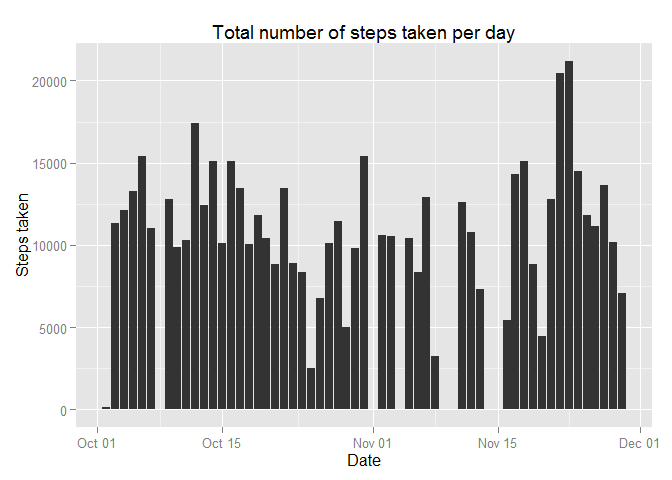
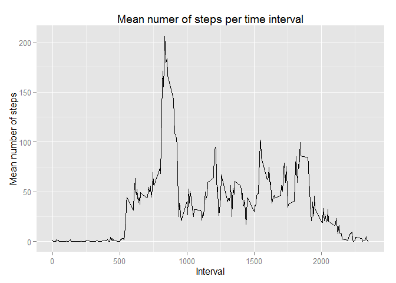
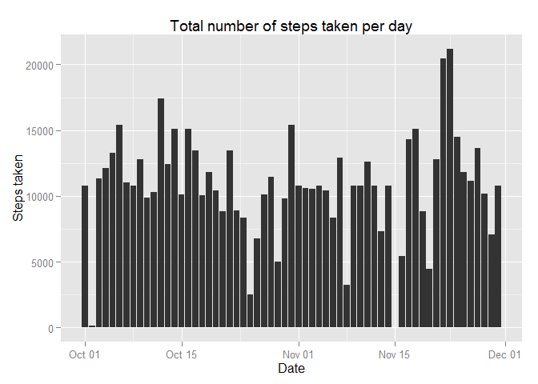
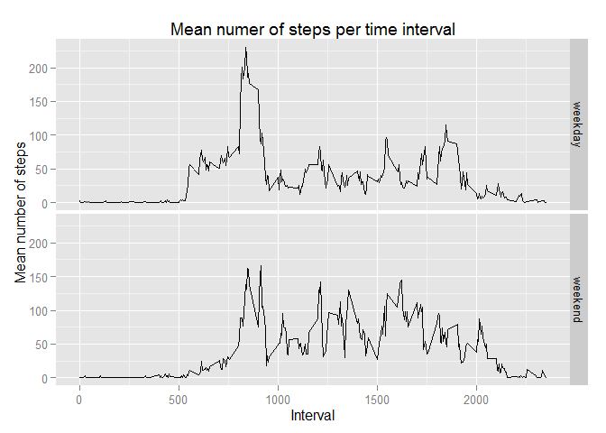

# Reproducible Research: Peer Assessment 1


```r
library(knitr)
```

```
## Warning: package 'knitr' was built under R version 3.2.4
```

```r
library(ggplot2)
opts_chunk$set(fig.path = 'figure/')
```


## Loading and preprocessing the data
In this section of code we read the data and pass 'date' format to the date colomn:

```r
## Reading data and preprocessing the data
activity <- read.csv(unzip('activity.zip'))
activity$date <- as.Date(as.character(activity$date), '%Y-%m-%d')
```

## What is mean total number of steps taken per day?

### 1. Make a histogram of the total number of steps taken each day

```r
qplot(data = activity, x = date, y = steps, geom = 'bar',
      stat = 'identity', xlab = 'Date', ylab = 'Steps taken',
      main = 'Total number of steps taken per day')
```

```
## Warning: Removed 2304 rows containing missing values (position_stack).
```



### Calculate and report the mean and median total number of steps taken per day

```r
activity.days <- tapply(activity$steps, activity$date, sum)
activity.mean <- mean(activity.days, na.rm = TRUE)
activity.mean
```

```
## [1] 10766.19
```

```r
activity.median <- median(activity.days, na.rm = TRUE)
activity.median
```

```
## [1] 10765
```

## What is the average daily activity pattern?

### 1. Make a time series plot of the 5-minute interval (x-axis) and the average number of steps taken, averaged across all days (y-axis)

```r
activity.intervals <- data.frame(tapply(activity$steps, activity$interval, mean,
                                        na.rm = TRUE))
colnames(activity.intervals) <- 'steps'
activity.intervals$interval <- row.names(activity.intervals)
qplot(data = activity.intervals, x = as.numeric(interval), y = steps,
      geom = 'line', main = 'Mean numer of steps per time interval',
      xlab = 'Interval', ylab = 'Mean number of steps')
```



### Which 5-minute interval, on average across all the days in the dataset, contains the maximum number of steps?

```r
activity.intervals[activity.intervals$steps == max(activity.intervals$steps),]
```

```
##        steps interval
## 835 206.1698      835
```

## Imputing missing values

### 1. Calculate and report the total number of missing values in the dataset (i.e. the total number of rows with NAs)

```r
sum(is.na(activity$steps))
```

```
## [1] 2304
```

### 2.Devise a strategy for filling in all of the missing values in the dataset. The strategy does not need to be sophisticated. For example, you could use the mean/median for that day, or the mean for that 5-minute interval, etc.
In this section we create a new dataframe and add a aolumn with average steps per interval

```r
activity.imputed <- activity
activity.imputed$impute <- 
        round(activity.intervals[as.character(activity.imputed$interval), 1])
```

### 3.Create a new dataset that is equal to the original dataset but with the missing data filled in.
In this section we replace the missing values with averrage steps by inverval

```r
activity.imputed$steps[is.na(activity.imputed$steps)] <- activity.imputed$impute
```

```
## Warning in activity.imputed$steps[is.na(activity.imputed$steps)] <-
## activity.imputed$impute: number of items to replace is not a multiple of
## replacement length
```

```r
activity.imputed <- activity.imputed[,-4]
```

### 4. Make a histogram of the total number of steps taken each day and Calculate and report the mean and median total number of steps taken per day.

```r
qplot(data = activity.imputed, x = date, y = steps, geom = 'bar',
      stat = 'identity', xlab = 'Date', ylab = 'Steps taken',
      main = 'Total number of steps taken per day')
```



```r
activity.imputed.days <- tapply(activity.imputed$steps, activity.imputed$date, sum)
activity.imputed.mean <- mean(activity.imputed.days, na.rm = TRUE)
activity.imputed.mean
```

```
## [1] 10765.64
```

```r
activity.imputed.median <- median(activity.imputed.days, na.rm = TRUE)
activity.imputed.median
```

```
## [1] 10762
```

## Are there differences in activity patterns between weekdays and weekends?
### 1.Create a new factor variable in the dataset with two levels -- "weekday" and "weekend" indicating whether a given date is a weekday or weekend day.

```r
activity.imputed$day <- 'weekday'
activity.imputed$day[weekdays(activity.imputed$date) == 'Saturday'] <- 'weekend'
activity.imputed$day[weekdays(activity.imputed$date) == 'Sunday'] <- 'weekend'
activity.imputed$day <- as.factor(activity.imputed$day)
```

### 2.Make a panel plot containing a time series plot (i.e. type = "l") of the 5-minute interval (x-axis) and the average number of steps taken, averaged across all weekday days or weekend days (y-axis).

```r
activity.aggregated <- aggregate(.~interval + day, data = activity.imputed, mean)
qplot(data = activity.aggregated, x = as.numeric(interval),y = steps,
      facets = day~., geom = 'line', stat = 'identity', xlab = 'Interval',
      main = 'Mean numer of steps per time interval',
      ylab = 'Mean number of steps')
```



